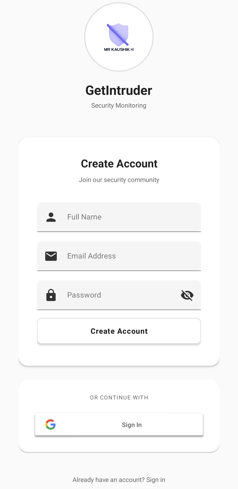
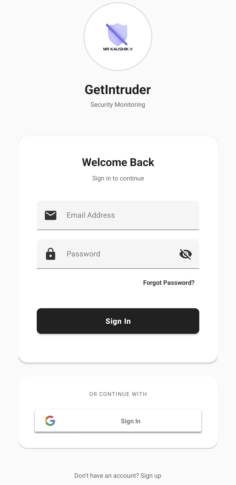
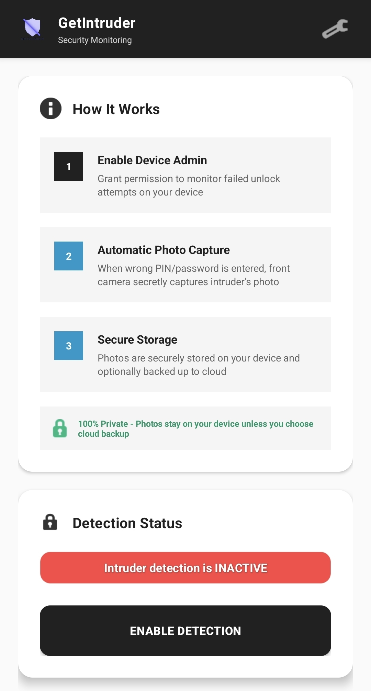
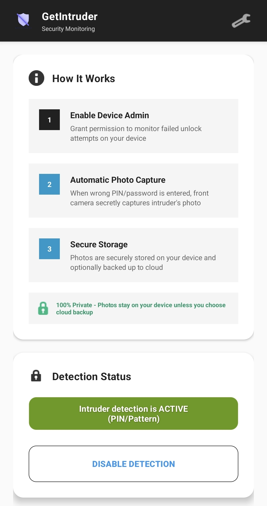
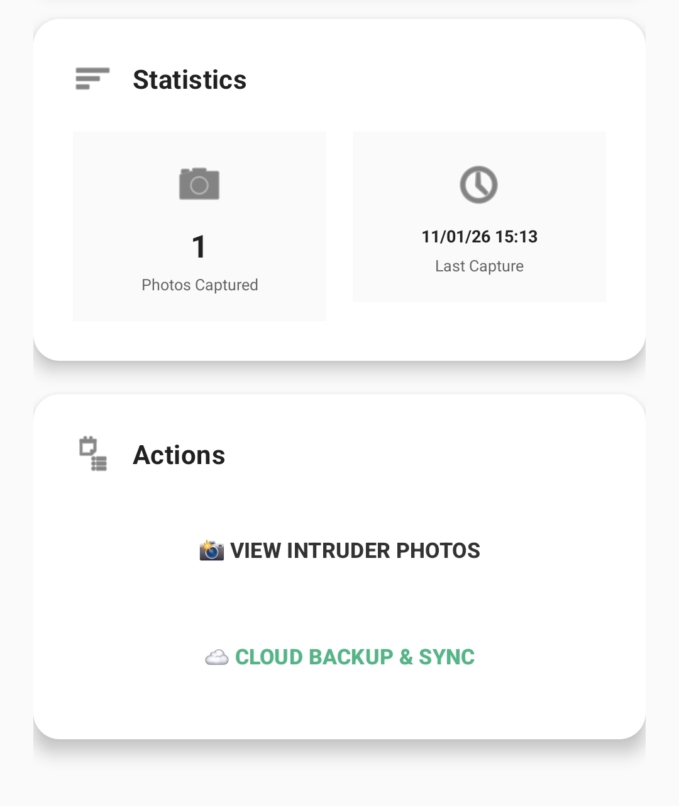
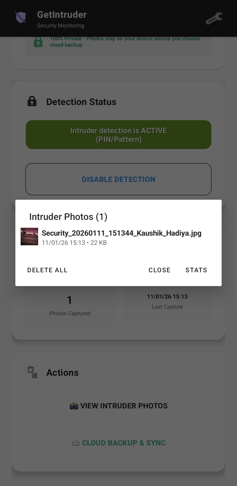
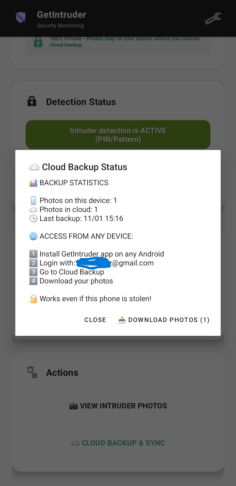
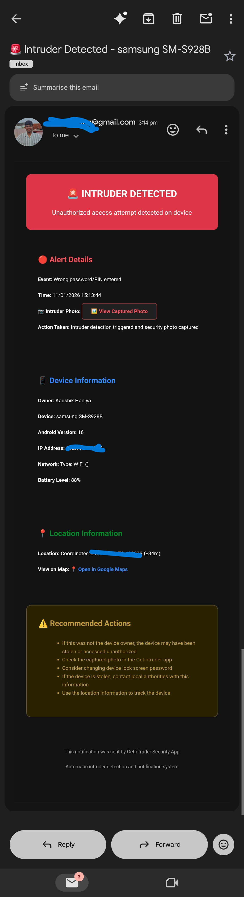

# 🛡️ LockSpectre - Mobile Security App

> **Professional Android security monitoring application that automatically detects and documents unauthorized access attempts.**

[](https://developer.android.com)
[](https://firebase.google.com/)
[](LICENSE)

## ✨ Features

- **🔐 Intruder Detection** - Monitors failed PIN/password attempts
- **📸 Auto Photo Capture** - Captures front camera photos in <2 seconds  
- **☁️ Cloud Backup** - Secure Firebase Storage with user isolation
- **📧 Email Alerts** - Instant notifications with location and photo links
- **📱 Professional UI** - Clean Material Design interface
- **🌍 Location Tracking** - GPS coordinates with each security event
- **🔄 Cross-Device Access** - View photos from any authenticated device

## 🚀 Quick Start

### Prerequisites
- Android Studio Arctic Fox or later
- Android SDK (API Level 26+)
- Firebase project with Auth, Firestore, and Storage

### Setup
1. **Clone the repository**
   ```bash
   git clone https://github.com/MrKaushikH/getintruder.git
   cd getintruder
   ```

2. **Configure Firebase**
   - Create a Firebase project at [console.firebase.google.com](https://console.firebase.google.com)
   - **Important**: Use your Firebase-matched package name in `app/build.gradle.kts` (this project is configured for `com.ansh.lockspectre`)
   - Download `google-services.json` and place in `app/` directory
   - Enable Authentication (Email/Password + Google)
   - Enable Firestore Database and Storage

3. **Build and Run**
   ```bash
   ./gradlew assembleDebug
   # Install APK: app/build/outputs/apk/debug/app-debug.apk
   ```

### Secret Management (Required Before Running)

1. Copy `.env.example` to `.env` and fill your real values locally.
2. For Firebase Functions production, set secrets via CLI:
   - `firebase functions:secrets:set EMAIL_USER`
   - `firebase functions:secrets:set EMAIL_PASS`
   - `firebase functions:secrets:set EMAIL_SERVICE`
3. Put your real `google-services.json` in `app/` locally (the committed file is a safe placeholder).
4. Keep private assets in `secure_backup/` (already gitignored).

### GitHub Safety Checklist

Before pushing, ensure your real Firebase config is not staged:

```bash
git rm --cached app/google-services.json
git status --short
```

Keep `app/google-services.json.template` in git, and keep the real `app/google-services.json` only on your local machine.

## 🏗️ Architecture

- **Frontend**: Android (Java) with Material Design Components
- **Backend**: Firebase (Auth, Firestore, Storage, Functions)
- **Security**: Device Admin API for failure detection
- **Camera**: Camera2 API with optimized capture pipeline
- **Notifications**: Firebase Cloud Messaging + Email

## 📱 Screenshots

### 🔐 Authentication Flow
<div align="center">

| Register | Login |
|----------|-------|
|  |  |
| *Clean registration with validation* | *Secure login with password toggle* |

</div>

### 🛡️ Security Monitoring
<div align="center">

| Main Dashboard (Disabled) | Main Dashboard (Enabled) |
|---------------------------|--------------------------|
|  |  |
| *Device admin setup required* | *Security monitoring active* |

</div>

### 📊 Analytics & Management
<div align="center">

| Statistics | Photo Gallery |
|------------|---------------|
|  |  |
| *Security events & analytics* | *Intruder photo management* |

</div>

### ☁️ Cloud Features
<div align="center">

| Cloud Backup Status | Email Notifications |
|---------------------|---------------------|
|  |  |
| *Firebase storage sync status* | *Instant email alerts with photos* |

</div>

### 🚀 Key UI Features Showcased:
- **Clean Material Design** with black & white theme
- **Professional authentication** with input validation
- **Device admin integration** with clear status indicators
- **Real-time statistics** showing security events
- **Photo management** with thumbnails and previews
- **Cloud synchronization** with upload progress
- **Email notification system** with photo links
- **Responsive design** across different screen sizes

## 🔒 Security Features

- **User Data Isolation** - Each user can only access their own data
- **Secure Firebase Rules** - Production-grade access controls
- **Encrypted Communication** - All data transmitted securely
- **Local Photo Storage** - Photos stored in app-private directories

## 📄 License

This project is licensed under the MIT License - see the [LICENSE](LICENSE) file for details.

## ⚠️ Disclaimer

This app is designed for legitimate security monitoring of your own devices. Users are responsible for complying with local laws and obtaining necessary permissions before deployment.

---

<div align="center">
  <strong>Built for security professionals and privacy-conscious users</strong>
</div>
